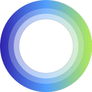

# Mac Assistive Touch 🍎✨

<p align="center">
  
</p>

<p align="center">
  <b>A lightweight, zero-latency, VisionOS & Liquid Glass inspired native AssistiveTouch floating orb and productivity hub for macOS.</b>
</p>

<p align="center">
  
  
  
  
  
</p>

---

## 🌟 Highlights

**Mac Assistive Touch** brings the beloved iOS AssistiveTouch paradigm to macOS with a modern desktop twist. Engineered entirely with **native AppKit and Swift 6**, it stays permanently accessible without stealing keyboard focus or cluttering your Dock.

- 🔮 **Liquid Glass Floating Orb:** Draggable, magnetized screen edge snapping, visionOS-inspired translucent materials, and an intelligent **Hide & Peek** auto-dock mode.
- 🚀 **Zero-Lag Action Hub:** Instant popup launcher featuring categorized apps, web bookmarks, and custom actions.
- ⚡️ **Spotlight Quick Search:** Press `⌘F` or simply start typing when the panel is open to filter and launch apps with `Return`.
- 📊 **Mach Kernel Hardware Telemetry:** Real-time, low-overhead CPU load, RAM usage, and battery monitoring directly from Darwin kernel APIs.
- 📝 **Instant Scratchpad:** Quick notepad in the top-right mini dock to jot down transient thoughts, code snippets, or numbers. Auto-saved locally.
- 📋 **Integrated Clipboard History:** Retains your recent copied snippets for 1-click re-copying.
- 🎨 **160+ SF Symbols Icon Picker:** 100% offline, zero-size overhead icon picker with search, category filtering, and custom SF Symbol input.
- 🌐 **Multilingual Interface:** Full live support for both **English 🇬🇧** and **Turkish 🇹🇷** with instant runtime toggling.

---

## ⌨️ Gestures & Shortcuts

| Action | Mouse / Touch Gesture | Keyboard Shortcut |
| :--- | :--- | :--- |
| **Toggle Menu Panel** | Left Click on Orb | `⌥ Option + Space` |
| **Screen Capture** | Double Click on Orb | — |
| **Lock Screen** | Long Press (~0.5s) on Orb | — |
| **Drag & Snap** | Drag orb to screen edges | — |
| **Hide & Peek** | Hover mouse on screen edge | — |
| **Spotlight Search** | — | `⌘F` (within panel) |
| **Dismiss / Clear** | — | `Esc` |

---

## 📦 Download & Installation

### Option 1: Direct Download (Recommended)
1. Go to the [**Latest Releases**](https://github.com/abdurrahimicyer/mac_assistive_touch/releases) page.
2. Download the pre-built `MacAssistiveTouch-v1.0.0.zip`.
3. Unzip and drag **MacAssistiveTouch.app** into your **Applications** (`/Applications`) folder.
4. Double-click to launch!

> **💡 First Launch Tip (macOS Gatekeeper):**  
> Because this is a free, community open-source app built without an Apple Developer Certificate, macOS may show a *"cannot be opened because the developer cannot be verified"* alert.  
> Simply **Right-Click (or Control-Click)** `MacAssistiveTouch.app` and choose **Open** ➔ **Open**, or run this one-line command in Terminal:
> ```bash
> xattr -cr /Applications/MacAssistiveTouch.app
> ```

---

### Option 2: Build from Source (For Developers)

#### Prerequisites
- macOS 14.0 (Sonoma) or macOS 15.0+ (Sequoia)
- Xcode 15+ or Swift 6 Command Line Tools

#### Quick Build & Run
Clone the repository and run the standalone package script:

```bash
# Clone repository
git clone https://github.com/abdurrahimicyer/mac_assistive_touch.git
cd mac_assistive_touch

# Compile and package MacAssistiveTouch.app
chmod +x build_app.sh
./build_app.sh

# Launch the app
open MacAssistiveTouch.app
```

The script compiles the binary with Swift Package Manager in release mode and bundles `AppIcon.icns`, `AppLogo.png`, and `Info.plist` into a standalone `.app` bundle ready to be dragged into `/Applications`.

---

## 🏗️ Architecture & Stack

- **Swift 6 & Structured Concurrency:** Deterministic, race-condition-free state management.
- **AppKit `NSPanel` & Zero-Lag Windowing:** Customized non-activating, floating window level (`.floating`) with smooth key-window focus handling.
- **SwiftUI & Glassmorphism:** Native `.ultraThinMaterial` and dynamic Light Glass / Dark Obsidian color schemes.
- **Mach Kernel APIs:** Kernel `host_statistics` polling for ultra-low CPU cycle consumption.
- **Global Event Monitor:** `NSEvent.addGlobalMonitorForEvents` for seamless system-wide hotkeys.

---

## 🤖 Built With & Acknowledgments

- **Lead Architecture & Engineering:** Designed, led, and architected by [Abdurrahim İçyer](https://github.com/abdurrahimicyer).
- **Pair-Programming Assistance:** Built in active pair-programming collaboration with **Google DeepMind Gemini** advanced agentic AI coding tools.
- **Icons & Design Language:** Apple SF Symbols and Apple Human Interface Guidelines (HIG).

---

## 👤 Author & Support

Developed with ❤️ by **Abdurrahim İçyer**

- 🌐 Personal: [www.abdurrahimicyer.com](https://www.abdurrahimicyer.com)
- 🏢 Company: [www.gratonya.com](https://www.gratonya.com)
- ✉️ Contact: [hello@gratonya.com](mailto:hello@gratonya.com)
- 🐙 GitHub: [@abdurrahimicyer](https://github.com/abdurrahimicyer)

---

## 📄 License

This project is licensed under the **MIT License** - see the [LICENSE](LICENSE) file for details.
